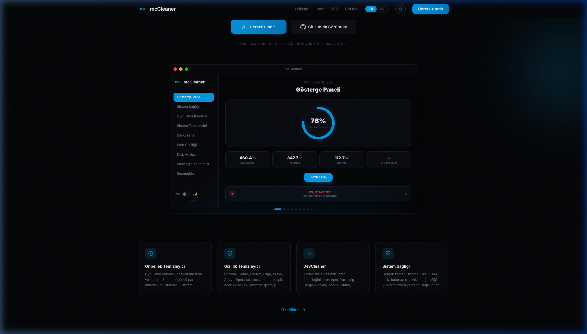

# mcCleaner

**Free system cleaner and optimizer for macOS and Windows**

Built with Rust + Tauri + React

[Website](https://mccleaner.com) · [Download](https://mccleaner.com/download) · [Features](https://mccleaner.com/features) · [FAQ](https://mccleaner.com/faq)

---

## Download

| Platform | Download |
|----------|----------|
| macOS (Apple Silicon) | [mcCleaner_aarch64.dmg](https://github.com/mehmetaltunel/mcCleaner-releases/releases/download/v0.3.3/mcCleaner_0.3.3_aarch64.dmg) |
| macOS (Intel) | [mcCleaner_x64.dmg](https://github.com/mehmetaltunel/mcCleaner-releases/releases/download/v0.3.3/mcCleaner_0.3.3_x64.dmg) |
| Windows (Installer) | [mcCleaner_x64-setup.exe](https://github.com/mehmetaltunel/mcCleaner-releases/releases/download/v0.3.3/mcCleaner_0.3.3_x64-setup.exe) |
| Windows (MSI) | [mcCleaner_x64.msi](https://github.com/mehmetaltunel/mcCleaner-releases/releases/download/v0.3.3/mcCleaner_0.3.3_x64_en-US.msi) |

Or visit [mccleaner.com/download](https://mccleaner.com/download)

---

## Features

### Cache Cleaner
Scans and removes application cache files. On macOS it checks `~/Library/Caches`, on Windows it checks `%LOCALAPPDATA%\Temp`. Only third-party app caches are listed — system-critical caches are always protected.

### Log Cleaner
Finds old log and diagnostic report files across the system. Frees up space from crash logs, app logs, and system diagnostic reports.

### Privacy Cleaner
Detects browser data (cache, cookies, browsing history, session data) for all major browsers: Chrome, Safari, Firefox, Edge, Brave, Arc, and Opera. Selectively clean any category per browser.

### DevCleaner
Scans cache directories for 19+ developer tools: npm, Yarn, pnpm, pip, Conda, RubyGems, CocoaPods, Cargo, Go, Gradle, Maven, NuGet, Homebrew, Docker, Xcode, Flutter/Dart, Composer, Android SDK, and Visual Studio. Includes an interactive file browser to inspect and selectively delete contents.

### System Health Check
Real-time monitoring dashboard showing CPU usage, RAM, disk space, battery status, CPU/GPU temperatures, network traffic, load average, process count, and uptime. Displays an overall health score.

### Disk Analyzer
Visual disk usage overview with a large file finder. Streams results in real-time and supports scan cancellation.

### App Manager
Lists all installed applications with their sizes and icons. Scans for residual files (preferences, caches, support files) left behind by apps. Supports complete uninstallation.

### Startup Manager
View and manage applications that launch at system startup. Disable unnecessary startup items to speed up boot time.

---

## Tech Stack

| Layer | Technology |
|-------|-----------|
| Backend | Rust |
| Framework | Tauri v2 |
| Frontend | React + TypeScript |
| Styling | CSS (custom design system) |
| Build | Vite |
| CI/CD | GitHub Actions |
| Auto-Update | Tauri Updater |

---

## Comparison

| Feature | mcCleaner | CleanMyMac | OnyX |
|---------|:---------:|:----------:|:----:|
| Free | Yes | No | Yes |
| Cross-Platform | Yes | No | No |
| Cache Cleaning | Yes | Yes | Yes |
| Log Cleaning | Yes | Yes | Yes |
| Privacy Cleaning | Yes | Yes | No |
| DevCleaner (19+ tools) | Yes | No | No |
| Disk Analyzer | Yes | Yes | No |
| App Manager | Yes | Yes | No |
| System Health Monitor | Yes | No | No |
| Startup Manager | Yes | Yes | No |
| Auto-Update | Yes | Yes | No |

---

## Support

If you find mcCleaner useful, consider supporting development:

---

## License

[MIT](LICENSE) — Mehmet Altunel 2026

[mccleaner.com](https://mccleaner.com) · [mehmetaltunel.com](https://mehmetaltunel.com) · [xyzapps.net](https://xyzapps.net) · [GitHub](https://github.com/mehmetaltunel)
